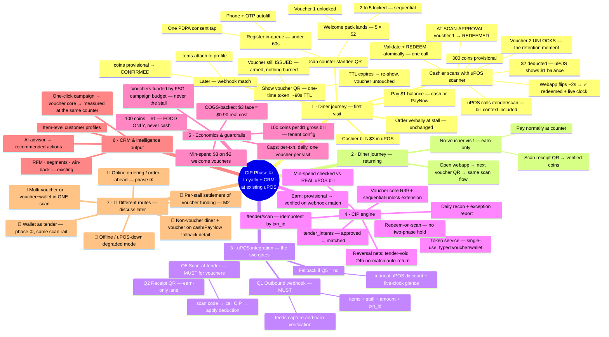

# CIP Phase ① — Flow Mindmap (loyalty first, at the existing uPOS counter)

_Working map of the LOCKED phase-① flow (decisions 2026-06-12 — see `decisions.md`; full spec
`architecture/payments.md` §7b/§8). **Branches marked 🔀 are different routes to be discussed
later** — they're placeholders, not designs. Renders as a diagram on GitHub (Mermaid)._

## Reading order
- The happy path = branch **1** top-to-bottom (the worked example: 2 kopi · $3 bill · $2 voucher ·
  $1 paid · 300 coins).
- Branch **3** is what FSG asks uPOS in Week 0 — Q1 + Q5 gate the whole phase.
- Branch **7** items are intentionally undesigned; pull one into a session to spec it.
