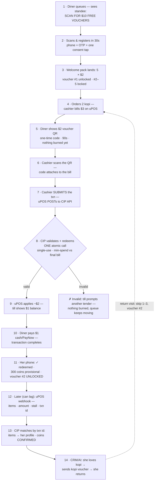
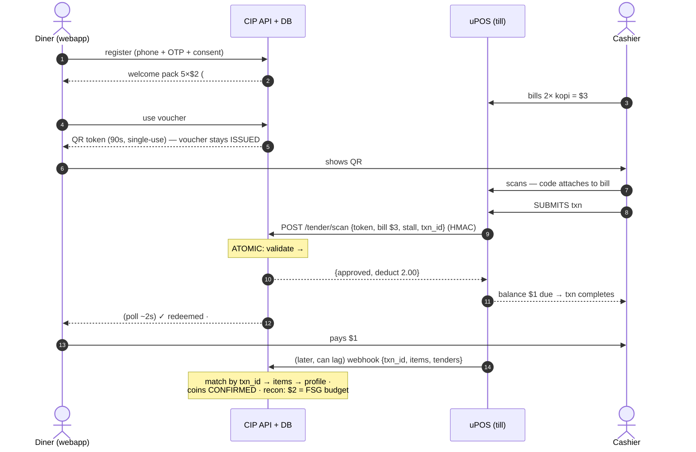

# CIP Phase ① — Flow (loyalty first, at the existing uPOS counter)

_The LOCKED phase-① flow (decisions 2026-06-12; full spec `architecture/payments.md` §7b/§8).
Drawn as ONE vertical step flow. Routes not yet designed are listed at the bottom._

## The 30-second version (for the FSG room — board + their uPOS CTO)

**Mei Ling's first visit:**
1. **While queueing**, sees *"Scan for $10 FREE vouchers"* — scans, phone number, done. → *FSG gains
   a member in 30 seconds, before she even orders.*
2. Orders 2 kopi; cashier bills **$3 on uPOS** — nothing changes. → *same till, same routine.*
3. Shows her $2 voucher; cashier **scans it with the same uPOS scanner**; **on submit, uPOS checks
   the voucher with CIP** → till shows **$1** → she pays $1. → *FSG knows who bought what, where,
   for how much.*
4. Her phone: **"300 coins earned! Voucher #2 unlocked."** → *a manufactured reason to return — 4
   more times.*
5. Next week the AI notices she loves kopi → sends a kopi voucher. → *marketing that pays for
   itself, measured at the till.*

**The money:** she SEES $5 of free value; FSG PAYS food cost only (≈$1.80, spread over 2+ visits);
FSG COLLECTS $1 cash today vs $0.90 kopi cost — **never cash-negative, even on the free-gift visit.**

**For the uPOS CTO — uPOS is NOT replaced; one integration, all stalls, three capabilities:**
1. **Voucher at tender** (the only new cashier steps): scan the diner's voucher QR (attaches to the
   bill as a tender line) → **on transaction submit, uPOS POSTs to the CIP API** (validate + redeem,
   one call) → **valid: $2 applied, transaction completes**; invalid: till prompts another tender —
   nothing burned, queue keeps moving. *Exactly how gift-card tenders work today.*
2. **After sale:** send the sale record (items, amount, stall, txn id). *Batched or delayed is fine.*
3. *Nice-to-have:* a QR on the printed receipt so members who paid without a voucher still earn.

Same integration later takes the **FS Wallet** as a tender — build once, two products. Signed calls
both ways · idempotent · **zero customer personal data enters uPOS** (PDPA-clean).

## The step flow

**Returning diner:** skips steps 1–3 (already a member) — opens the webapp at step 5 with the next
voucher. **No-voucher visit:** pays normally, scans the receipt QR (uPOS capability 3) → earns coins.

## 🔀 Different routes — discuss later (undesigned placeholders)
- Wallet as tender — phase ②, same scan rail (one scan = voucher + wallet remainder)
- Online ordering / order-ahead — phase ③
- Voucher on a cash/PayNow payer where uPOS can't scan (manual fallback detail)
- Multi-voucher in one transaction
- Per-stall settlement of voucher funding — M2
- Offline / uPOS-down degraded mode

## Engineering detail — data flow per actor (the build contract for /tender/scan + the webhook)

