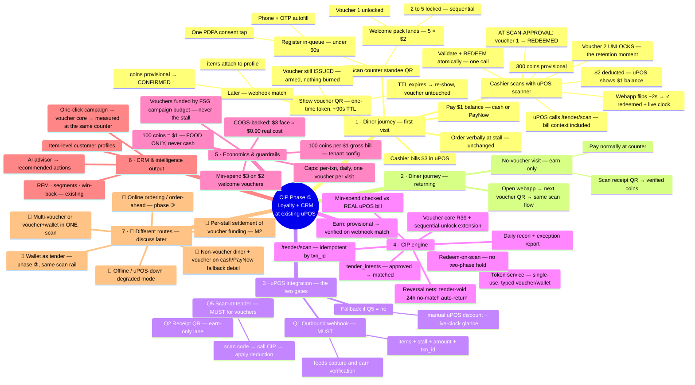
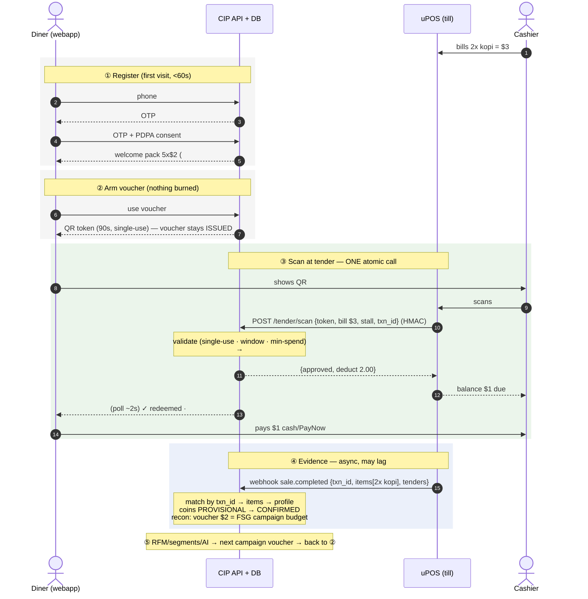

# CIP Phase ① — Flow Mindmap (loyalty first, at the existing uPOS counter)

_Working map of the LOCKED phase-① flow (decisions 2026-06-12 — see `decisions.md`; full spec
`architecture/payments.md` §7b/§8). **Branches marked 🔀 are different routes to be discussed
later** — they're placeholders, not designs. Renders as a diagram on GitHub (Mermaid)._

## The 30-second version (for the FSG room — board + their uPOS CTO)

**Mei Ling's first visit:**
1. **While queueing**, sees *"Scan for $10 FREE vouchers"* — scans, phone number, done. → *FSG gains
   a member in 30 seconds, before she even orders.*
2. Orders 2 kopi; cashier bills **$3 on uPOS** — nothing changes. → *same till, same routine.*
3. Shows her $2 voucher; cashier **scans it with the same uPOS scanner** → till shows **$1** → she
   pays $1. → *FSG knows who bought what, where, for how much.*
4. Her phone: **"300 coins earned! Voucher #2 unlocked."** → *a manufactured reason to return — 4
   more times.*
5. Next week the AI notices she loves kopi → sends a kopi voucher. → *marketing that pays for
   itself, measured at the till.*

**The money:** she SEES $5 of free value; FSG PAYS food cost only (≈$1.80, spread over 2+ visits);
FSG COLLECTS $1 cash today vs $0.90 kopi cost — **never cash-negative, even on the free-gift visit.**

**For the uPOS CTO — uPOS is NOT replaced; one integration, all stalls, three capabilities:**
1. **At tender** (the only new cashier step): scan a QR → call our API → apply the returned
   deduction → show balance due. *Exactly how gift-card tenders work today.*
2. **After sale:** send the sale record (items, amount, stall, txn id). *Batched or delayed is fine —
   nothing at the counter waits on it.*
3. *Nice-to-have:* a QR on the printed receipt so members who paid without a voucher still earn.

Same integration later takes the **FS Wallet** as a tender — build once, two products. Signed calls
both ways · idempotent (a retry can never double-deduct) · **zero customer personal data enters uPOS**
(PDPA-clean).

---

## Reading order
- The happy path = branch **1** top-to-bottom (the worked example: 2 kopi · $3 bill · $2 voucher ·
  $1 paid · 300 coins).
- Branch **3** is what FSG asks uPOS in Week 0 — Q1 + Q5 gate the whole phase.
- Branch **7** items are intentionally undesigned; pull one into a session to spec it.

## Data flow — the counter transaction (sequence)

