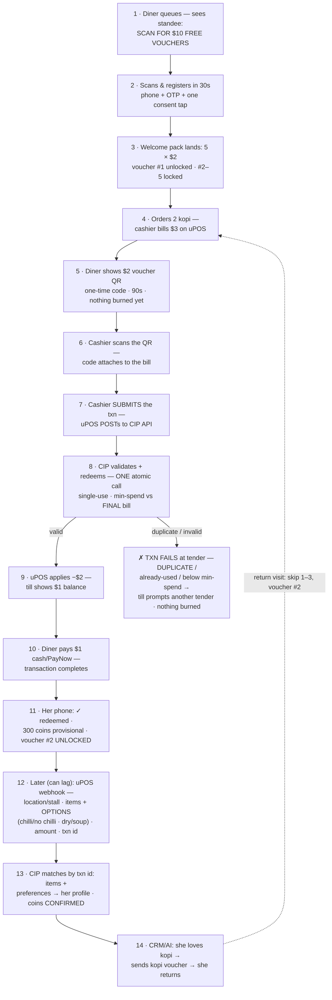
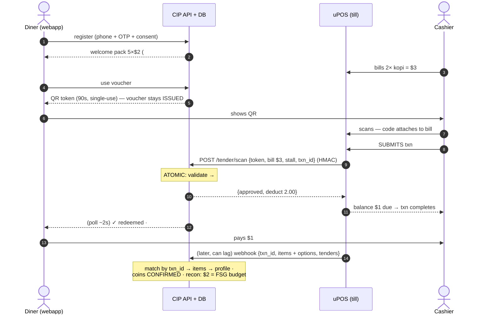

# CIP Phase ① — Flow (loyalty first, at the existing uPOS counter)

_The LOCKED phase-① flow (decisions 2026-06-12; full spec `architecture/payments.md` §7b/§8).
ONE vertical step flow, every step a box. Routes not yet designed are listed at the bottom._

## The 30-second version (for the FSG room — board + their uPOS CTO)

**Mei Ling's first visit:**
1. **While queueing**, sees *"Scan for $10 FREE vouchers"* — scans, phone number, done. → *FSG gains
   a member in 30 seconds, before she even orders.*
2. Orders 2 kopi; cashier bills **$3 on uPOS** — nothing changes. → *same till, same routine.*
3. Shows her $2 voucher; cashier **scans it with the same uPOS scanner**; **on submit, uPOS checks
   the voucher with CIP** → till shows **$1** → she pays $1. → *FSG knows who bought what, where,
   for how much.*
4. Her phone: **"300 coins earned! Voucher #2 unlocked."** → *a manufactured reason to return — 4
   more times.*
5. Next week the AI notices she loves kopi → sends a kopi voucher. → *marketing that pays for
   itself, measured at the till.*

**The money:** she SEES $5 of free value; FSG PAYS food cost only (≈$1.80, spread over 2+ visits);
FSG COLLECTS $1 cash today vs $0.90 kopi cost — **never cash-negative, even on the free-gift visit.**

**For the uPOS CTO — uPOS is NOT replaced; one integration, all stalls, three capabilities:**
1. **Voucher at tender** (the only new cashier steps): scan the diner's voucher QR (attaches to the
   bill as a tender line) → **on transaction submit, uPOS POSTs to the CIP API** (validate + redeem,
   one call) → **valid: $2 applied, transaction completes**; invalid: till prompts another tender —
   nothing burned, queue keeps moving. *Exactly how gift-card tenders work today.*
2. **After sale:** send the sale record (items, amount, stall, txn id). *Batched or delayed is fine.*
3. **Must-have: a QR on every printed receipt** — it's three lanes in one: the **discovery door**
   (non-members join from the receipt — Flow B), the **no-voucher earn lane**, and the **resilience
   lane** (earning keeps working even if the connection is down — Flow C).

Same integration later takes the **FS Wallet** as a tender — build once, two products. Signed calls
both ways · idempotent · **zero customer personal data enters uPOS** (PDPA-clean).

## The step flow

### Plain-text version (readable anywhere — terminal, raw file)

```text
+--------------------------------------------------------+
| 1 . Diner queues - sees standee:                       |
|     "SCAN FOR $10 FREE VOUCHERS"                       |
+--------------------------------------------------------+
                            |
                            v
+--------------------------------------------------------+
| 2 . Scans & registers in 30s                           |
|     phone + OTP + one consent tap                      |
+--------------------------------------------------------+
                            |
                            v
+--------------------------------------------------------+
| 3 . Welcome pack lands: 5 x $2                         |
|     voucher #1 unlocked . #2-5 locked                  |
+--------------------------------------------------------+
                            |
                            v
+--------------------------------------------------------+
| 4 . Orders 2 kopi -                                    |
|     cashier bills $3 on uPOS   <----------------+      |
+--------------------------------------------------------+
                            |
                            v
+--------------------------------------------------------+
| 5 . Diner shows $2 voucher QR                          |
|     one-time code . 90s . nothing burned yet           |
+--------------------------------------------------------+
                            |
                            v
+--------------------------------------------------------+
| 6 . Cashier scans the QR -                             |
|     code attaches to the bill                          |
+--------------------------------------------------------+
                            |
                            v
+--------------------------------------------------------+
| 7 . Cashier SUBMITS the txn -                          |
|     uPOS POSTs to CIP API                              |
+--------------------------------------------------------+
                            |
                            v
+--------------------------------------------------------+
| 8 . CIP validates + redeems - ONE atomic call          |
|     single-use . min-spend vs FINAL bill               |
+--------------------------------------------------------+
        valid |                | duplicate / already-used /
              |                | below min-spend
              |                v
              |   +--------------------------------------+
              |   | x TXN FAILS - till prompts another   |
              |   |   tender . nothing burned .          |
              |   |   queue keeps moving                 |
              |   +--------------------------------------+
              v
+--------------------------------------------------------+
| 9 . uPOS applies -$2 -                                 |
|     till shows $1 balance                              |
+--------------------------------------------------------+
                            |
                            v
+--------------------------------------------------------+
| 10 . Diner pays $1 cash/PayNow -                       |
|      transaction completes                             |
+--------------------------------------------------------+
                            |
                            v
+--------------------------------------------------------+
| 11 . Her phone: OK redeemed .                          |
|      300 coins provisional . voucher #2 UNLOCKED       |
+--------------------------------------------------------+
                            |
                            v
+--------------------------------------------------------+
| 12 . Later (can lag): uPOS webhook -                   |
|      location/stall . items + OPTIONS                  |
|      (chilli/no chilli . dry/soup) . amount . txn id   |
+--------------------------------------------------------+
                            |
                            v
+--------------------------------------------------------+
| 13 . CIP matches by txn id: items +                    |
|      preferences -> her profile . coins CONFIRMED      |
+--------------------------------------------------------+
                            |
                            v
+--------------------------------------------------------+
| 14 . CRM/AI: she loves kopi ->                         |
|      sends kopi voucher -> SHE RETURNS                 |
|      (return visit: skip 1-3, voucher #2 -> step 4)    |
+--------------------------------------------------------+
```

### Same flow, rendered (GitHub / VS Code preview with the Mermaid extension)



**Returning diner:** skips steps 1–3 (already a member) — opens the webapp at step 5 with the next
voucher. **No-voucher visit:** pays normally, scans the receipt QR → earns coins (and a non-member who does
this lands in **Flow B** — the receipt is an acquisition door).


## Flow B — discovery via the receipt (diner didn't know the program exists)

_The receipt QR is the second acquisition door: pay first, discover after. Same claim rail as the
no-voucher earn lane; one-time claim per txn._

```text
+--------------------------------------------------------+
| B1 . New diner orders + pays $3 as usual -             |
|      has never heard of the loyalty program            |
+--------------------------------------------------------+
                            |
                            v
+--------------------------------------------------------+
| B2 . Receipt prints with a QR:                         |
|      "SCAN - CLAIM 300 COINS FOR THIS MEAL"            |
+--------------------------------------------------------+
                            |
                            v
+--------------------------------------------------------+
| B3 . Scans at the table -> registers in 30s            |
|      phone + OTP + one consent tap                     |
+--------------------------------------------------------+
                            |
                            v
+--------------------------------------------------------+
| B4 . Claims this receipt - one-time per txn,           |
|      claim window (config, ~7 days)                    |
|      -> 300 coins (provisional -> confirmed)           |
|      -> AND the welcome pack lands: 5 x $2             |
+--------------------------------------------------------+
                            |
                            v
+--------------------------------------------------------+
| B5 . Next visit: uses voucher #1 ->                    |
|      joins the MAIN FLOW at step 4                     |
+--------------------------------------------------------+
```

## Flow C — connection down (degraded mode)

_Vouchers degrade gracefully (deferred, never burned). **Accrual never stops** (the receipt QR prints
locally); **redemption resumes on restore** (provisional coins aren't spendable until confirmed —
decided 2026-06-13). uPOS **MUST queue + replay webhooks (store-and-forward)** — mandated, not
optional (§8 Q1b). **Break-glass IF uPOS genuinely can't comply:** the signed-token receipt QR earns
from the receipt alone (amount-only, no items) — kept as pilot insurance, not the plan._

```text
+--------------------------------------------------------+
| C1 . uPOS <-> CIP connection is DOWN                   |
+--------------------------------------------------------+
                            |
                            v
+--------------------------------------------------------+
| C2 . Voucher scan at tender -> POST times out          |
|      -> DECLINED -> cashier takes another tender       |
|      voucher stays ISSUED - perk deferred, NOT lost    |
+--------------------------------------------------------+
                            |
                            v
+--------------------------------------------------------+
| C3 . Receipt STILL prints its QR -                     |
|      printing is local, txn id is local,               |
|      CIP is not in that loop                           |
+--------------------------------------------------------+
                            |
                            v
+--------------------------------------------------------+
| C4 . Diner scans (her phone is online) -> CIP          |
|      doesn't know the txn yet -> claim PENDING:        |
|      "300 coins reserved - confirming"                 |
|      provisional coins visible, NOT spendable          |
+--------------------------------------------------------+
                            |
                            v
+--------------------------------------------------------+
| C5 . Connection RESTORES -> uPOS replays its           |
|      queued webhooks (store-and-forward) ->            |
|      match by txn id -> coins CONFIRMED + spendable    |
|      . items + options attach                          |
+--------------------------------------------------------+
                            |
                            v
+--------------------------------------------------------+
| C6 . Pending claim unmatched 72h AFTER RECONNECT ->    |
|      expires + lands on the exception report           |
|      (timer runs from reconnect, NOT from claim -      |
|       a long outage must not expire valid claims)      |
+--------------------------------------------------------+
```

## 🔀 Different routes — discuss later (undesigned placeholders)
- Wallet as tender — phase ②, same scan rail (one scan = voucher + wallet remainder)
- Online ordering / order-ahead — phase ③
- Voucher on a cash/PayNow payer where uPOS can't scan (manual fallback detail)
- Multi-voucher in one transaction
- Per-stall settlement of voucher funding — M2

## Engineering detail — data flow per actor (the build contract for /tender/scan + the webhook)


